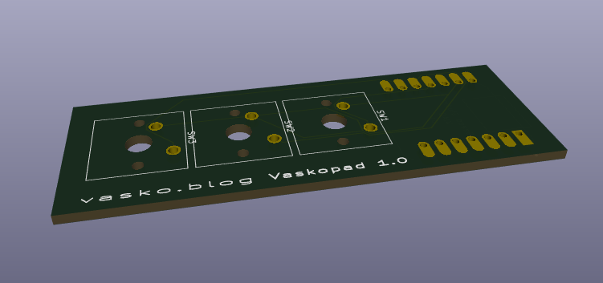

# Vaskopad

A simple 3-key mechanical macropad built for the Hackpad competition using a Seeeduino XIAO and Cherry MX switches.

## Repo Structure
* `production/` - KiCad PCB design files and production Gerbers and firmware
* `cad/` - Enclosure and top plate 3D models (`.step` files included)

## Assembly
1. Print the case and plate files from the `cad/` folder.
2. Snap the switches into the top plate and solder them to the PCB.
3. Place the assembled board into the case (it rests on the inner support ledge).

Built for Hack Club's Hackpad event.
* Special thanks to the mechanical keyboard and open-source CAD community for assistance in refining the enclosure geometry and support structures.
